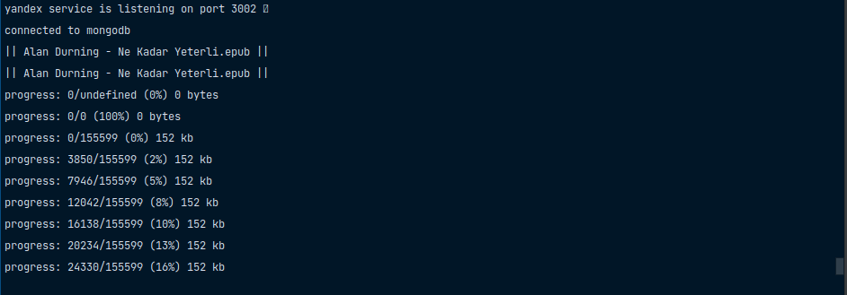

# kitapbar.com

## Development

* start mongodb server

```bash
docker-compose -f docker-compose.dev.yaml up -d
cd services/yandex && yarn dev
cd services/client && yarn dev
```

## Contributing

Please feel free to contribute. For new features, first open an issue to discuss what you want.

## Screenshots

<div style='display: flex; flex-direction: column; gap: 10px; align-items: center; justify-content: center'>
  
  
  
</div>

## License

MIT
